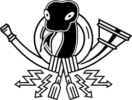

postamt
=======

Light package that makes typical mail tasks easy:

 * Mail body both in plain text and HTML
 * Unicode in body and subject
 * Inline attachments (e.g. for HTML resources)
 * Attachments, with optional mime-type detection

Usage
-----

Create a plain Message and send it::

    m = Message("sender@example.org", "to@example.net", "Re: Mail Lib", "Hi!")
    send_mails([m])

Messages can be altered::

    m.subject = "The Plan"
    m.body = "Hi!\\nK-thx-bye!"

    # add an alternative HTML version
    m.html = "<h1>Hi!</h1>"

    m.recipients = ['to@example.net', 'metoo@example.net']
    m.cc = 'someone@example.net'
    m.bcc = 'mum@example.org'

    m.date = 387784800
    m.headers['X-Client-ID'] = 655

Send HTML Mails with inline Images::

    m.html = "Look at this:  isnt that cool?"
    m.inline('amazing.png', file('newlook.png'))

Attach files::

    m.attach('notice.pdf', file('notice.pdf'))

See pydoc for a full description of all parameters.
